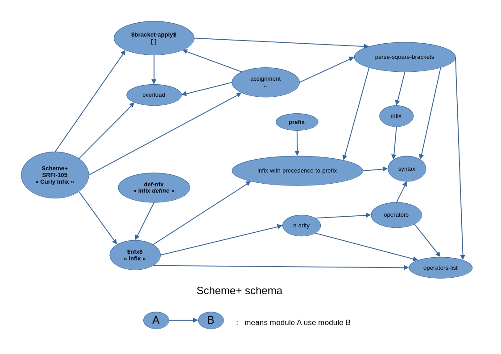

# Scheme-PLUS-for-Racket
Scheme+ for DrRacket by Damien Mattei.

Install as a package with the ~~[package manager](https://pkgs.racket-lang.org/package/Scheme-PLUS-for-Racket)~~ source code.

The documentation is here, but is outdated:
https://github.com/damien-mattei/Scheme-PLUS-for-Racket/blob/gh-pages/README.md

Designed to use with [SRFI 105 Curly Infix reader for Racket](https://github.com/damien-mattei/SRFI-105-for-Racket).




With Racket you do not need to define/declare a variable with the
Scheme+ operator <+. Because the binding of the variable is autodetect
you can simply set the variable with <- (or :=) and Scheme+ will do the job.


The Racket GUI can not display the line of error in a Scheme+ program.
If you have to debug your source code you must generate a Scheme file
from your Scheme+ file with curly-infix2prefix4racket and load the
result file in Racket GUI. Then you will have all the debug
information of Racket on the scheme file.Another solution is to simply copy/paste the pure Racket
code generated by the SRFI 105 Curly Infix parser and run it like a normal Racket program.
Again you will have all the information about errors with the true line number displayed.
Another method is to use the [Makefile](https://github.com/damien-mattei/Scheme-PLUS-for-Racket/blob/main/examples/racket/Makefile) provided (see docs).


Hi "[Racketeers](https://www.youtube.com/watch?v=MBB-hMt9240)" :slight_smile: , 

i present the lastest feature of scheme+ for racket that allow the melting in an expression of both infix and prefix sub-expressions. 
There is a disambiguating algorithm based on a finite state machine. 
Note that some expression would need to be detected not only at the syntax parsing but at the execution stage.(which is not yet implemented,will be in future version).

This feature allow to get rid of use of special { } curly brackets as it is now auto-detected by scheme syntax transformers, and so you just have to use normal ( ) parenthesis. 
But then you have to use a special definition procedure called `define+` but i have modified in scheme+ the classic `define` of scheme to integrate in it the `define+` special feature, still with 100% compatibility with scheme. So you rarely have to use `define+`.
As there is no more needs to use { } you can get rid of the use of `#lang reader SRFI-105` if you just use the infix/prefix syntax, but if you want to use the indexing via [  ] yo still need the SRFI-105 parser.

Note that it could be strange to mix infix and prefix sub-expressions in an expression it is more logic to keep the same syntax in all the expression. It just could be possible because the algorithm is recursive and check the syntax for all the sub expressions, allowing the mix

Here is some concrete examples:

Note that i really prefer for infix definitions a syntax like `{x := infix_expressions ...}` instead of `(define x infix_expressions ...)` 

```scheme
Welcome to DrRacket, version 8.17 [cs].
Language: racket, with debugging; memory limit: 14000 MB.
> (require Scheme+)

Scheme+ v10.0 by Damien Mattei

(define x  3 * 5 + 2)
x
17

(define t  3 * (+ 2 4) - 1)
t
17

(define z  (3 + 1) * (2 * (+ 2 1) - (sin 0.3)) + ((* 2 5) - 5))
z
27.817919173354642

(define x  1 + 2 + 3)
x
6

(define k  10.0 - 3.0 - 4.0 + 1 - 5.0 * 2.0 ** 3.0 / 7.0 ** 3.0)
k
3.883381924198251

(define a 7)
(define b 3)
(define r  a * - b)
r
-21

(define s  3 ² + 2 · 3 · 5 + 5 ²)
 s
64

(define s  3 ² + 2 * 3 * 5 + 5 ²)
s
64

```


And here is a simple list of  examples or piece of code tested or running REPL-SRFI-105-Racket.rkt :  

```scheme
Welcome to DrRacket, version 8.14 [cs].
Language: reader SRFI-105, with debugging; memory limit: 8192 MB.
SRFI 105 Curly Infix for Scheme+ v9.8
SRFI-105 Curly Infix parser for Racket Scheme and R6RS by Damien MATTEI
(based on code from David A. Wheeler and Alan Manuel K. Gloria.)

Possibly skipping some header's lines containing space,tabs,new line,etc  or comments.

SRFI-105.rkt : number of skipped lines (comments, spaces, directives,...) at header's beginning : 12

Parsed curly infix code result = 

(module repl racket (provide (all-defined-out)) (require Scheme+))

Scheme+ v10.0 by Damien Mattei

;; examples in REPL begins here:
{3 * (+ 2 4) - 1}
17

{(- 7 (3 * (+ 2 4) - 1))}
-10

{(3 + 1) * (2 * (+ 2 1) - sin(0.3)) + ((* 2 5) - 5)}
27.817919173354642
;; the above is in prefix : (+ (* (+ 3 1) (- (* 2 (+ 2 1)) (sin 0.3))) (- (* 2 5) 5))

(define n 7)
{2 * (- n 4)}
6

(define a 3)
(define b 5)
{n + (- b a)}
9


```
