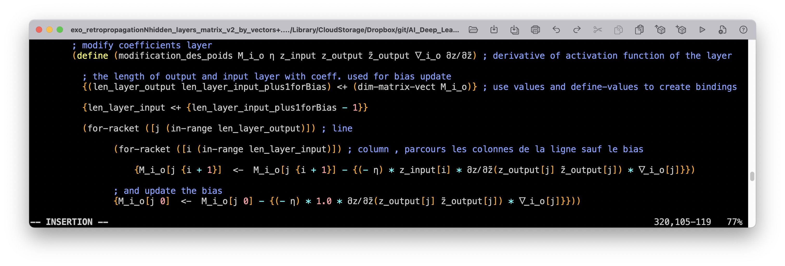

<body>
  <p>
      <br>
  </p>
  <div align="center">
    <br>
  </div>
  <div align="center"></div>
    <h2 style="text-align: center;"><span style="color: #00cccc;"><i>Enhancing
          Scheme (and Lisp-like) language. </i></span></h2>
    <h2 style=" text-align: center;">Damien Mattei<br>
    </h2>
    <p style="text-align: center;"><i><br>
      </i></p>
    <p style="text-align: center;"><i>"Doubts are such tiny things. A mind with
        no room for doubts must have no room for thoughts either."</i> -<a href="https://www.ics.uci.edu/%7Epattis/"
        target="_blank">R. Patti</a></p>
    <p style="text-align: center;"><br>
    </p>
    <h1 style="text-align: center;"><b><span style="color: #000099;">Scheme+</span></b><b><span
          style="color: #999999;"> <font size="+2">version 9.7 for Racket Scheme<br>
          </font></span></b></h1>
    <p style="text-align: center;">
	Display options for viewing this documentation:<br>
  <br>
  <br>
    <a href="https://damien-mattei.github.io/Scheme-PLUS-for-Racket/Scheme+.html">Click here for the light HTML page version of this
  page.</a>
  <br>
  <br>
    <a
  href="https://damien-mattei.github.io/Scheme-PLUS-for-Racket/Scheme+io.html">Click
  here for the dark Hacker Theme version of this page.</a>
   </p>
    <p><br>
    </p>
    <h2><u>1. Scheme+ at a glance:&nbsp;</u></h2>
	
	
<p><b>Scheme+ is an extension of the syntax of the <a href="https://en.wikipedia.org/wiki/Scheme_%28programming_language%29"
          target="_blank">Scheme</a> language.</b><br>
    </p>
	<p><b>Scheme+ is to Scheme what a concept-car is to
	automobile.Scheme+ is a concept-language.It is ideally what
	should be a modern Scheme.</b>
	</p>
    <p><b>Scheme+ makes it easy the assignment of Scheme objects </b><b>in
        infix </b><b>(works also in prefix) </b><b>notation </b><b>with a few
        new operators&nbsp;</b><b> </b><b><b><b>← (or&nbsp;</b></b>
  &lt;-), [ ],</b><b><font
          size="+2">⥆ </font>(or &lt;+) . </b><br>
    </p>
	<div align="center"><br>
          </div>
	<p><b>The idea of Scheme+ first come to my mind when comparing the
  assignation syntax used in Clojure with Scheme and Lisp, and later
  the easyness of creating and assigning variables in Python
  completely convince me that the Scheme system have to be enhanced.</b><br>
    </p>
    <p>The <b>idea</b> of <b>Scheme+</b> is also came from this : <b>
	<i>"Why is it
          so boring to define variables in Scheme with the traditionnal set of
          LET,LET*,LETREC,LET-VALUES special forms?"</i></b> and <b><i>"Is it
          possible to use a single mechanism for assignment in Scheme?"</i></b></p>
    <p>It comes also from the ascertainment that <i><b>"A computer language is
          created by ONE man, later, a community only bring a library to the
          language without self-questioning any more on the fundations of
          language itself."</b></i></p>
    <p><i><b><br>
        </b></i></p>
    <p><i>Scheme+</i> brings syntax to classic <i>Scheme</i> language like
      those:</p>
    <p><br>
    </p>
    <p style="margin-left: 40px;"><b>{x &lt;- y} </b>infix assignment of the
      value of y to the variable x.</p>
    <div style="margin-left: 40px;"> </div>
    <p style="margin-left: 40px;">The same thing with a new symbol
      ←&nbsp; :&nbsp; (unicode 2190 in hexadecimal that can be enter under Linux
      with Ctrl-Shift u 2190 Enter or Space bar)</p>
    <p style="margin-left: 40px;"><b>{x ← y}</b></p>
	<p style="margin-left: 40px;"><b>With operator precedence: {xp <-
  {x - v * t} / (sqrt {1 - v ** 2 / c ** 2})}</b></p>
 <p style="margin-left: 40px;"><b> {M_i_o[j {i + 1}]  <-  M_i_o[j {i + 1}] + η * z_input[i] * მzⳆმz̃(z_output[j] z̃_output[j]) * ᐁ_i_o[j]}</b></p>
    <div style="margin-left: 40px;"> </div>
    <div style="margin-left: 40px;"> </div>
	<div style="margin-left: 40px;"> This documentation is sometimes outdated as Scheme+ is updated
	  , the last versions of Scheme+ allow infix operator precedence using the classic parenthesis ( ) .</div>
	<div style="margin-left: 40px;"> example: {3 * (3 + 2) + 2} gives the result 17 but beware that now we can no longer write {x <- (cons + arg-list)} but instead (define op+ +) , {x <- (cons op+ arg-list)} , this makes Scheme+ a bit less compatible with Scheme than the previous versions were.</div>
		<div style="margin-left: 40px;"></div>
		<pre>
		  {(a * x) + y + (d * x) / (add1 (x ** 2))}
		  
		  {(ksx / (sqrt 2)) * (x + y)}
		  
		  (define (σ z̃) 
		       {1 / (1 + (exp (- z̃)))}
		  
		  (define z   3 * 5 + 2)
		  
		  (define a   2 * (cos (2 * pi * p / q)) )
		  </pre>
		<div style="margin-left: 40px;"> <br></div>
	<div style="margin-left: 40px;">For debugging a Scheme+ program there is a Makefile in examples/racket that when put in a directory containing Scheme+ files will parse them, the parsed files will be in parsed_files_directory and then you can run those files in Racket that will display the right error lines, matching with source Scheme+ then can be done easily. </div>							<div style="margin-left: 40px;"> </div>
    <p style="margin-left: 40px;">Assignment from right to left : <b>{y ← 7}</b></p>
    <p style="margin-left: 40px;">Assignment from left to right :
  <b>{7 → y}</b></p>
<p><font size="+3">⥆</font>&nbsp; or &lt;+ : Define and assign a
new variable in the current environment ,example : <font
size="+2">{v ⥆ 7}</font></p>
<p style="margin-left: 40px;">
<meta http-equiv="content-type" content="text/html; charset=UTF-8">
</p>
<p style="margin-left: 40px;">(unicode 2946 , on <a
href="https://apple.stackexchange.com/questions/183045/how-can-i-type-unicode-characters-without-using-the-mouse"
moz-do-not-send="true">Mac OS use </a>
<meta http-equiv="content-type" content="text/html; charset=UTF-8">
<a
href="https://apple.stackexchange.com/questions/183045/how-can-i-type-unicode-characters-without-using-the-mouse"
moz-do-not-send="true">CTRL+CMD+space to bring up the characters
popover, </a>
<meta http-equiv="content-type" content="text/html; charset=UTF-8">
<a
href="https://apple.stackexchange.com/questions/183045/how-can-i-type-unicode-characters-without-using-the-mouse"
moz-do-not-send="true">then type in u+unicode  (ex: u+2946) and hit Enter to
get it</a>)<br>, and in Emacs you can insert an unicode char with the sequence:
<meta http-equiv="content-type" content="text/html; charset=UTF-8">
<code>‘C-x 8 RET’</code> followed with unicode of the character
you want)<br>
<br>
</p>
<p style="margin-left: 40px;"><b>{T[k]} </b>return value of vector or array
      T indexed by k.</p>
    <div style="margin-left: 40px;"> </div>
    <p style="margin-left: 40px;"><b>{T</b><b>[k] &lt;- x} </b>infix assignment
      of <b>T</b><b>[k] </b>with x.</p>
    <div style="margin-left: 40px;"> </div>
    <p style="margin-left: 40px;"><b>{T</b><b>[k] &lt;- </b><b><b>T</b><b>[{k +
          1}]</b>} </b>in infix or the same with a little part of classic
      prefix Scheme:&nbsp; <b>{T</b><b>[k] &lt;- </b><b><b>T</b><b>[(+ k 1)]</b>}
        <br>
      </b></p>
    <div style="margin-left: 40px;"> </div>
    <p style="margin-left: 40px;">the same with multi dimensional arrays or
      matrix: <br>
      <b><b>{</b>T</b><b>[m n]} </b>return the value of the multi dimension
      array T indexed by m and n</p>
    <div style="margin-left: 40px;"> </div>
    <p style="margin-left: 40px;"><b><b>{</b>T</b><b>[m n] &lt;- </b><b><b>T</b><b>[m {n + 1}]</b>}</b></p>
    <p style="margin-left: 40px;"><br>
      <b><b>{</b>T</b><b>[m n] ← </b><b><b>T</b><b>[m {n +
  1}]</b>}</b></p>
  <p style="margin-left: 40px;"><b>compatible with strings:</b></p>
    <p style="margin-left: 40px;"><b>{str &lt;+ (string-copy "hello")}<br>
      </b></p>
    <p style="margin-left: 40px;"><b>"hello"<br>
      </b></p>
    <p style="margin-left: 40px;"><b>{str[4]}<br>
      </b></p>
    <p style="margin-left: 40px;"><b>#\o<br>
      </b></p>
    <p style="margin-left: 40px;"><b>{str[4] &lt;- #\a}<br>
      </b></p>
    <p style="margin-left: 40px;"><b>#\a<br>
      </b></p>
    <p style="margin-left: 40px;"><b>str<br>
      </b></p>
    <p style="margin-left: 40px;"><b>"hella"</b></p>
    <p style="margin-left: 40px;"><b><br>
	<p style="margin-left: 40px;"><b>Slicing for vectors and strings as in Python: </b></p>
	<p style="margin-left: 40px;"><b>{s[2 * 3 - 4 : 2 * 3 + 1 : 2 * 4 - 6] <- "0000"}</b></p>
 <p style="margin-left: 40px;"><b>"ab0d0f0h"</b></p>
    <p style="margin-left: 40px;"><b>with function definition:<br>
      </b></p>
  <p style="margin-left: 40px;"><b>(declare fact)<br>
{fact &lt;- (λ (n) (if {n &lt;&gt; 0} {n * (fact {n - 1})}
1))}<br>
</b></p>
<p style="margin-left: 40px;"><b>or just:<br>
</b></p>
<p style="margin-left: 40px;"><font size="+1"><b>{fact ⥆ (λ (n) (if
{n &lt;&gt; 0} {n * (fact {n - 1})} 1))}</b></font></p>
<p style="margin-left: 40px;"><b>{fact(8)}<br>
40320<br>
</b></p>
    <div style="margin-left: 40px;"> </div>
    <p style="margin-left: 40px;"> no more need of <strike>LET,LET*,LETREC,LET-VALUES</strike>,...
      </p>
    <div style="margin-left: 40px;"> </div>
    <p style="margin-left: 40px;"><b>←</b><b> is an n-arity operator,
        example :</b></p>
    <p style="margin-left: 40px;">(declare x y z t)<br>
      {x ← y ← z ← t ← 7}<br>
      &nbsp;7<br>
      &nbsp;(list x y z t)<br>
      &nbsp;(7 7 7 7)</p>
    <p style="margin-left: 40px;">Another example which build an
      identity matrix:</p>
<p style="margin-left: 40px;">(require srfi/25)<br>
</p>
<p style="margin-left: 40px;">&nbsp;(declare I)<br>
&nbsp;{I ← (make-array (shape 0 4 0 4))}<br>
&nbsp; <br>
&nbsp;&nbsp;&nbsp; <br>
&nbsp;{I[0 0] ← I[1 1] ← I[2 2] ← I[3 3] ← 1}<br>
&nbsp;1<br>
&nbsp;&nbsp;&nbsp; <br>
&nbsp;&nbsp;I<br>
&nbsp; #&lt;array:srfi-9-record-type-descriptor&gt;</p>
<p style="margin-left: 40px;">&gt; {I[0 0]}<br>
1<br>
&gt; {I[0 1]}<br>
0<br>
    <p style="margin-left: 40px;"><br>
      defining new functions with <b>def </b>instead of the classic define we
      can now use <b>return</b> to escape immediately from the current level of recursive call and <b>return-rec</b> to escape from the full stack of recursive calls:<br>
    </p>
    <div style="margin-left: 40px;"> </div>
    <p style="margin-left: 40px;"><b>(return)</b><br>
    </p>
    <div style="margin-left: 40px;"> </div>
    <p style="margin-left: 40px;">or returning the value v: </p>
    <div style="margin-left: 40px;"> <b>(return </b>v<b>)</b></div>
    <p style="text-align: left;"><b> <br>
      </b></p>
	  <p style="margin-left: 40px;">The &lt;+ operator works also for
defining multiple values :<br>
</p>
<p style="margin-left: 40px;">{(a b c) &lt;+ (values 7 8 9)}<br>
7<br>
8<br>
9<br>
(list a b c)<br>
'(7 8 9)<br>
</p>
<p style="margin-left: 40px;">{(x y z) &lt;+ (u v w) &lt;+ (a b
c)&nbsp; &lt;+ (values 2 4 5)}<br>
2<br>
4<br>
5<br>
(list x y z u v w a b c)<br>
'(2 4 5 2 4 5 2 4 5)<br>
</p>
<p style="margin-left: 40px;">We can also assign multiple values on
the fly:<br>
</p>
<p style="margin-left: 40px;">(declare x y z)<br>
{(x y z) &lt;v (values 2 4 5)}<br>
2<br>
4<br>
5<br>
(list x y z)<br>
'(2 4 5)<br>
(declare u v w)<br>
{(x y z) &lt;v (u v w) &lt;v (values 2 4 5)}<br>
2<br>
4<br>
5<br>
(list x y z u v w)<br>
'(2 4 5 2 4 5)<br>
</p>
<p style="margin-left: 40px;"><br>
</p>
<p>Here is an example of the previous features about a <a href="https://en.wikipedia.org/wiki/Subset_sum_problem#Pseudo-polynomial_time_dynamic_programming_solutions"
        target="_blank">dynamic solution of the subset sum problem</a>:  </p>


```scheme
#lang reader SRFI-105


(require Scheme+)


; first stage overloading if any


(declare L-init t-init ls dyna cpt)

{L-init <- '(1 3 4 16 17 24 45 64 197 256 275 323 540 723 889 915 1040 1041 1093 1099 1111 1284 1344 1520 2027 2500 2734 3000 3267 3610 4285 5027)}
{t-init <- 35267}
{ls <- (length L-init)}
{dyna <- (make-array 0 {ls + 1} {t-init + 1})}

(define (one-two b)
  (if b 1 2))

{cpt <- 0}


(def (subset-sum-dynamic L t)

  (declare ls dyn c R s) ;; declare multiple variables

  {ls <- (length L)}
  {dyn <- dyna[ls t]} ;; dyna is a toplevel defined array

  ;; dyna[ls t] means : 0: unknown solution, 1: solution found, 2: no solution

  (if {dyn <> 0} ;; IF or WHEN : it is the same thing here (only one statement)
      (return (one? dyn)))

  (when (null? L)
    {dyna[ls t] <- 2}
    (return #f))

  {c <- (first L)}

  (when {c = t}  ;; c is the solution
    {dyna[ls t] <- 1}
    (return #t))

  {R <- (rest L)} ;; continue searching a solution in the rest

  (if {c > t}  ;; c is to big to be a solution
    {s <- (subset-sum-dynamic R t)}
    ;; c is part of the solution or c is not part of solution
    {s <- {(subset-sum-dynamic R {t - c}) or (subset-sum-dynamic R t)}})

  {dyna[ls t] <- (one-two s)}
  s) ;; return boolean value


```


<pre>
(subset-sum-dynamic  L-init t-init)
#t
<br>
</pre>

<p style="margin-left: 40px;">Operator and function overloading:<br>
A possibility of defining overloaded functions or operators is given with this syntax:<br>
</p>
<pre>

<br>
(define-overload-existing-n-arity-operator +)<br>
(define (add-n-lists . vn-lst) (implementation-add-n-lists
vn-lst))<br>

(define (implementation-add-n-lists vn-lst)
  {map-args <+ (cons + vn-lst)}
  (apply map map-args))
  
  
(overload-existing-n-arity-operator + add-n-lists (list? list?))

{'(1 2 3) + '(4 5 6) + '(7 8 9)}<br>
(12 15 18)<br>
<br>
(define-overload-existing-operator *)<br>
(define (mult-num-list k v) (map (λ (x) (* k x)) v))<br>
(overload-existing-operator * mult-num-list (number? list?))<br>

{3 * '(1 2 3) + '(4 5 6) + '(7 8 9)}<br>
(14 19 24)<br>

</pre>
<br>
Note that when a function that overload an operator has more than 2 args (f a1 a2 a3 ...) and only (f a1 a2) is defined
we do: (f a1 (f a2 a3 ...)) for operators.<br>
A complete set of new procedures and macros: <br>
<pre>
define-overload-procedure
overload-procedure

 define-overload-existing-procedure
overload-existing-procedure
	 
 define-overload-operator
overload-operator
	 
 define-overload-existing-operator
 overload-existing-operator
	 
 define-overload-n-arity-operator
 overload-n-arity-operator
	 
 define-overload-existing-n-arity-operator
 overload-existing-n-arity-operator
	 
 overload-square-brackets
 </pre>
allow overloading of both
functions and operators. Those macros call procedures written
recursively or imperatively with hash tables  depending of scheme
 implementation  because all predicate
must be test to find the matching
procedure as Scheme is not a typed language.<br> 
<br>
<br>
<br>
<p>
  Warnings about code highlighting tag due to bugs in Github Markdown
  system:<br>
  <br>
  -if you read this page on github.com the code examples display
  encapsuled between tags 'highlight scheme' and 'endhighlight'
  composed also with {} and % characters.<br>
  <br>
  -if you read this page on github.io the code examples display
  starting with 3 backquotes char , the tag 'scheme' and ending again
  with 3 backquotes char. The curly brackets {} display in a
  rectangular with red background because the Github Jekill rouge
  theme (unfortunately the ony one available) does not understand the
  infix notation of Scheme.This is,of course, not what i expected but i
  can not find any issue to this problem.<br>
  <br>
  Those weirds Markdown and tags should not be displayed and are not part of Scheme+ examples.
  <a
    href="https://damien-mattei.github.io/Scheme-PLUS-for-Racket/Scheme+.html"
    target="_blank">for a better view click here (or do not care of
  highlighting tag and triple backquotes when code is displayed!)</a><br>
    </p>

<br>
<br>

  <p>Another example with DrRacket Scheme in the REPL (Read Eval Print Loop):</p>
    <p> </p>
<br>
<p> </p> 
<br>
<p>Hash Tables support :</p>
    <pre>(require Scheme+)


; first stage overloading if any

(require srfi/69)   ;; support for SRFI 69 <meta http-equiv="content-type"
content="text/html; charset=utf-8">Basic hash tables

{my-hash-tbl &lt;+ (make-hash-table)} ;; add an object in the current environment, here a hash table
(hash-table? my-hash-tbl)
#t
<br>{my-hash-tbl["three"] &lt;- 3}
3<br><br>{my-hash-tbl["three"]}
3

</pre>

<br>


<br>Programs now needs to be parsed due to the use of optimization
schemes, it is automatic in Racket.

<br>

<p>for the rest read the documentation below and the online examples.</p>
    <br>
	
<br>
    <h2>2.<u>Download Scheme+:</u></h2>
    <p>The source code of <b>Scheme+</b> for <a href="https://racket-lang.org/"
        target="_blank">Racket implementation of Scheme</a> can be retrieved
      here: </p>
    <p><br>
    </p>
<h3 style="    text-align: center;">&gt;&gt;&gt;&nbsp;&nbsp; <a href="https://github.com/damien-mattei/Scheme-PLUS-for-Racket/zipball/main"
        target="_blank">Download Scheme+ as .zip</a>&nbsp;&nbsp; &lt;&lt;&lt;<br>
			</h3>
<p><br>
<h3 style="    text-align: center;">&gt;&gt;&gt;&nbsp;&nbsp; <a href="https://github.com/damien-mattei/Scheme-PLUS-for-Racket/tarball/main"
        target="_blank">Download Scheme+ as .tar.gz</a>&nbsp;&nbsp; &lt;&lt;&lt;<br>
		</h3>
<p><br>
    </p>
    <h3 style="    text-align: center;">&gt;&gt;&gt;&nbsp;&nbsp; <a href="https://github.com/damien-mattei/Scheme-PLUS-for-Racket"
        target="_blank">https://github.com/damien-mattei/Scheme-PLUS-for-Racket
        --&gt; Code --&gt; Download ZIP</a>&nbsp;&nbsp; &lt;&lt;&lt;<br>
    </h3>
    <p><br>
    </p>
	<p>Including : <br>
</p>
<div style="margin-left: 40px;"> </div>
<p style="margin-left: 40px;">The enhanced set of LET special forms
in the file let.scm.</p>
<div style="margin-left: 40px;"> </div>
<p style="margin-left: 40px;">Many of the examples of this web page
are in the source file SssDyna.scm.</p>
    <h2><br>
    </h2>
    <h2>3<u>.Requirements:</u><br>
    </h2>
    <p>Scheme+ needs a Scheme interpreter and will be adapted and
released for many Scheme (Guile,Racket,...), download Racket
Scheme:<br>
</p>
<a href="https://racket-lang.org/" target="_blank"></a><br>
<br>
<p>It has been developed with Racket on <b>Mac</b><font
color="#9999ff"><b> </b><b>OS</b></font> and Racket under <b>Linux</b>.<br>
<br>
<br>
<br>
</p>
<h2>4.<u>Author and license:</u></h2>
<p><b>Damien Mattei </b>; <b>Scheme+</b> : Copyright 2021-2022
    <b>Damien Mattei </b>under <a
href="https://www.gnu.org/licenses/gpl-3.0.txt" target="_blank">GNU GENERAL PUBLIC LICENSE Version 3</a></p>
<p>Nice - France (commune de Carros) </p>
<p> contact : firstname Dot lastname At Google Mail</p>
<p>Guagno - Island of Corsica </p>
<br>
<p>To subit an issue, a bug or something else related with the
Scheme+ code use the <a
href="https://github.com/damien-mattei/Scheme-PLUS-for-Racket/issues"
target="_blank" moz-do-not-send="true">Github issues system</a>.<br>
</p>
<p><br>
</p>
    <h2>5.<u>Installation:</u></h2>
	<p><br>
You also need the <a href="https://github.com/damien-mattei/SRFI-105-for-Racket">SRFI-105 Curly Infix language for Racket
and its REPL (Read Eval Print Loop) that will allow you to use infix
notation and Scheme+</a>.<br>
<br>
This is <b>mandatory</b>.<br>
<br>
<br>
<h2><u>6. Idea and rationale:</u></h2>
    <p>The core language of <a href="https://en.wikipedia.org/wiki/Scheme_%28programming_language%29"
        target="_blank">Scheme</a> and <a href="https://en.wikipedia.org/wiki/Lisp_%28programming_language%29"
        target="_blank">Lisp</a> are based on syntaxic form that date back from
      '50 for Lisp and '70 for Scheme. Syntactic forms such as the set of
      LET,LET*,LETREC,... have since long ago been replaced in many other
      languages (C/C++,Java,Fortran,Pascal,Javascript,BASIC (the LET keyword can
      be ommited in Applesoft Basic),by simple assignment operator that frees
      the syntax and allow saving indentation space, number of parenthesis,
      readability of code.</p>
    <p>The main idea of this project is to improve Scheme and Lisp like
      languages with syntaxic features,such as easy assignment for many object
      types (numbers,strings,vectors,arrays,etc),and also allowing an immediate
      'return' mechanism to escape from procedure when result is known and
      others features that exist in others languages
      (Python,Java,C/C++,Pascal,BASIC,Javascript). Some new features can be and
      are better used with infix notations (<a href="https://srfi.schemers.org/srfi-105/srfi-105.html"
        target="_blank">SRFI 105</a> known as "Curly Infix"),so for some
      syntactic expressions infix will be promoted (but not mandatory). </p>
    <p>A few new feature (see below) allow a great change in syntax and
      readability of Scheme programs. Less parenthesis are used,less indentation
      and it allows an enhanced programming style that modernize Scheme but also
      keep it 100% compatible with the original language.</p>
    <p>Also vectors and arrays in Scheme are painfully accessed and modified by
      vector-ref and vector-set! , Scheme+ use a simplier syntax again with the
      &lt;- operator and the [] syntax.</p>
    <p>This intuitive notation works also with Hash Tables.</p>
    <p>Scheme+ will remove the need for the classic LET set of special form, no
      more need of <strike>LET,LET*,LETREC,LET-VALUES</strike>,... and will use
      an unique infix (or not) assignment operator : &lt;-. (also LET are
      enhanced - the project starts historically by improving and simplifying LET, i
      simplified it so much that i remove it now! - in other versions such as
      let&lt;-arrow requiring less brackets, even if their use is useless and no
      more promoted, see extra features part)</p>
    <p><br>
    </p>
    <p><br>
    </p>
    <h2><u>7. Features:</u></h2>
    <p>The list of new features is subject to change and will grow by time, this
      version allows:</p>
    <ul>
      <li>use of infix SRFI 105 "Curly Infix" for some syntax forms</li>
      <li>Assignment operator : <b>&lt;-</b> (can be used in infix syntax and
        from left to right and right to left)</li>
      <li>Square Bracket operator<b> []</b> working with Scheme <b>Vectors,
          Arrays,Multidimentional Arrays,Hash Tables,Strings</b>...</li>
      <li>combination of Assignment operator &lt;- with [] operator for
        Vectors,Arrays,....</li>
      <li>RETURN : <b>return</b> keyword used in any procedure to return from
        procedure and return a value.</li>
      <li>declaration of variables</li>
      <li>declaration and assignment of variables with an infix operator.</li>
      <li>conditionals and execution of code in a new form : condx</li>
      <li>extra feature: new set of LET special forms,even if their use is
        completely discouraged in favor of assignment operator combined with
        declarative form (see declare).</li>
    </ul>
    <h2><br>
    </h2>
    <p><br>
    </p>
    <h2><u>8. First Examples:</u></h2>
    <h3 style=" margin-left: 40px;">The <a href="https://en.wikipedia.org/wiki/Fibonacci_number"
        target="_blank">Fibonacci sequence</a>:</h3>
    <p style="margin-left: 40px;">This example is written in Scheme with and
      without infix notation just to allow the reader to be familiar with "curly
      infix" notation which is not part of Scheme+ but used by it:</p>
    <p style="margin-left: 40px;">Here is the definition in classic prefix
      Scheme:</p>


```scheme


(define (fibonacci n)
  (if (< n 2)
    n
    (+ (fibonacci (- n 1)) (fibonacci (- n 2)))))


```


<p style="margin-left: 40px;">And here is a definition using "Curly Infix"
      SRFI 105:</p>


```scheme


(define (fib n)
  (if {n < 2}
      n
      {(fib {n - 1}) + (fib {n - 2})} ))


```


<p> </p>
    <br>
    <p>note that the last expression of fib: <b>{(fib {n - 1}) + (fib {n - 2})}
      </b>could also be expressed in curly infix Scheme like that :<b> {fib({n -
        1}) + fib({n - 2})}</b> or even like that: <b>{fib{n - 1} + fib{n - 2}}
      </b>but i will not use them, preferring to use infix only where
      mathematical calculus are coded and for comparaison tests in conditionals.</p>
    <p>Fibonacci is time consuming,even fib(47) can takes minutes to compute. We
      will write a faster dynamic version that memorize the results computed
      more than one time.</p>
    <p>Here is a solution in classic Scheme:</p>



```scheme


(define size0 10000)
(define memo0 (make-vector size0 0))return

(define (fibdyna0 n)
  (cond ((< n 2) n)
	((not (zero? (vector-ref memo0 n))) (vector-ref memo0 n))
	(else (let ((fibn (+ (fibdyna0 (- n 1)) (fibdyna0 (- n 2)))))
		(vector-set! memo0 n fibn)
		fibn))))


```



<p> </p>
    <br>
    <p>In the example above we can notice that the array access and modification
      is not easy to read and in the <b>else</b> block i have to use a <b>let</b>
      special form to create a local variable to return the value computed and
      already stored in array,even if i have not used a local variable i then
      must have to access the result in array to return it...</p>
    <p>Scheme+ allow to write code more readable and simpler than
    normal Scheme.</p>
	<p>Prior to use <b>Scheme+</b> for DrRacket Scheme, you must add a
<b>#lang reader SRFI-105 </b>directive in the first line of
your program and by inserting the statement 


(require Scheme+)


; first stage overloading if any

;
<br></p>
<p>Below is the version of the above code written in Scheme+ :</p>

    

```scheme

#lang reader SRFI-105
(require Scheme+)


; first stage overloading if any

{size <+ 10000}
{memo <+ (make-vector size 0)} 

(define (fibdyna n)
   (cond ({n < 2} n)
         ({memo[n] <> 0} {memo[n]})
         (else {memo[n] <- {(fibdyna {n - 1}) + (fibdyna {n - 2})}}) ))


```


</p>
    <p> </p>
    <br>
    <p>The reader can notice the introduction of one new assignment operator <b>&lt;-</b>
      and also <b>&lt;+</b>, the latter being simply an infix <b>define</b> of
      Scheme. The important point of the new assignment operator <b>&lt;-</b>
      of <b>Scheme+</b> is that it will work like the classic <b>set! </b>of
      Scheme on variables but also will work on more <b>complex object such as
        element of vectors,multidimensional arrays (as defined in
        SRFIs),... and much more in the next
        versions of Scheme+</b>. (we will see another more complex example with
      multidimentional array later)</p>
    <p>So <b>{x &lt;- 7} </b>simply assign 7 to the variable x but <b>{m[3]
        &lt;- 7}</b> will store 7 in the array <b>m </b>at the position
      indexed by 3. Access an element of array is also simpler in Scheme+ than
      in Scheme: <b>{m[3]}</b>. And this syntax is 100% compatible with Scheme,
      you can mix both the syntaxes if you want. This syntax is also more
      natural and readable and much like the mathematical notation, it is also a
      syntax used for arrays in other languages such as
      C/C++,Python,Java,Pascal,Javascript...</p>
    <p>Also you will notice&nbsp; that the main computation in the <b>else</b>
      block is now shorter and it is partly due to the fact that the assignment
      operator <b>&lt;- </b>return not NIL but the affected <b>value</b>
      making it available for other calculus or as a final result value.</p>
    <p>Here is now the same solution in a declarative form, in the part&nbsp;
      called "History of project" i explain why there exist two solutions. </p>
    <p>Instead of declare and assign the variables with the <b>define</b>
      nested in the <b>macro &lt;+ </b>we also can <b>declare</b> them and
      assign the variables later with the universal <b>&lt;-</b> operator:</p>
    <h2><br>
    </h2>



```scheme

#lang reader SRFI-105
(require Scheme+)

(declare size1 memo1)

{size1 <- 10000}
{memo1 <- (make-vector size 0)} 
  
(define (fibdyna1 n)
  (cond ({n < 2} n)
	({memo1[n] <> 0} {memo1[n]})
	(else {memo1[n] <- {(fibdyna1 {n - 1}) + (fibdyna1 {n - 2})}}) ))


```


<h2><br>
    </h2>
    <h2><u>9.Short documentation</u></h2>
    <p>Square bracket operator <b>[] </b>is used for vectors,arrays,hash tables,etc.</p>
    <p>example: <b>{T[k]} </b>return value of vector or array T indexed by k.</p>
    <p><br>
    </p>
    <p>Assignment operator <b>&lt;- </b>can be used only on existing single
      variables or vector,arrays,etc . Note that vector and arrays must be
      defined the usual way they are in Scheme. The operator &lt;- works also
      with multidimensional arrays.</p>
    <p>examples : </p>
    <ol>
      <li><b>{x &lt;- 7} </b></li>
      <li><b>{x &lt;- y} </b></li>
      <li><b>{m[3] &lt;- 7}</b></li>
      <li><b>{T</b><b>[k] &lt;- x}</b></li>
      <li><b>{T</b><b>[k] &lt;- </b><b><b>T</b><b>[k + 1]</b>}</b></li>
      <li><b><b>{</b>T</b><b>[m n] &lt;- </b><b><b>T</b><b>[m {n +
    1}]</b>}</b></li>
	<li><b>{my-hash-tbl["three"] &lt;- 3}</b></li>
    </ol>
    <p><br>
    </p>
    <p>Definition and assignment of variables is made with the <b>&lt;+</b>
      operator but can also be done with the classic Scheme <b>define</b>.</p>
    <p>example: {size &lt;+ 1000}</p>
    <p><br>
    </p>
    <p>Declaration of variable can also be used to <b>declare</b> one or many
      variables. (for explanation why there exist still <b>&lt;+</b> and <b>declare</b>
      and not only <b>&lt;-</b> read the part history of project)</p>
    <p>example: <b>(declare x y z t)</b></p>
    <p> </p>
    <br>
    <p><br>
    </p>
    <br>
    <p><u>How to load a Scheme+ program:</u></p>
    <p>Scheme+ programs are loaded this way in Racket and must have a
    <b>(provide (all-defined-out))</b> to export all  bindings:</p>
    <pre>(require "logiki+.rkt")<br><br>(infix-symb-min-dnf '{ {(not a) and (not b) and (not c) and (not d)} or {(not a) and (not b) and (not c) and d} or {(not a) and (not b) and c and (not d)} or {(not a) and b and (not c) and d} or {(not a) and b and c and (not d)} or {(not a) and b and c and d} or {a and (not b) and (not c) and (not d)} or {a and (not b) and (not c) and d} or {a and (not b) and c and (not d)} or {c and (not d)} } )
disj-norm-form = (or (and c (not d)) (and (not a) (not b) (not c) (not d)) (and (not a) (not b) (not c) d) (and (not a) b (not c) d) (and (not a) b c d) (and a (not b) (not c) (not d)) (and a (not b) (not c) d))
<br>'((¬b ∧ ¬c) ∨ (c ∧ ¬d) ∨ (¬a ∧ b ∧ d))</pre>
    <p>We can use a convention to name the Scheme+ programs and function with a
      + at end, keeping the .scm extension unchanged for compatibility.<br>
    </p>
    <p><br>
    </p>
    <h2>10<u>.Advanced examples:</u><br>
    </h2>
    <p>Here is another example, from the <a href="https://en.wikipedia.org/wiki/Subset_sum_problem#Pseudo-polynomial_time_dynamic_programming_solution"
        target="_blank">Subset Sum Problem</a> that show the use of <b>&lt;+</b>
      and <b>&lt;-</b> (due to the impossibility to have easily a single
      operator :-( ) :</p>


```scheme


#lang reader SRFI-105

(require Scheme+)

{L-init <+ '(1 3 4 16 17 24 45 64 197 256 275 323 540 723 889 915 1040 1041 1093 1099 1111 1284 1344 1520 2027 2500 2734 3000 3267 3610 4285 5027)}
{t-init <+ 35267}
{ls <+ (length L-init)}
{dyna <+ (make-array 0 {ls + 1} {t-init + 1})}

{cpt <+ 0} ;; define cpt to 0

(define (subset-sum-guile L t)

  {ls <+ (length L)}
  {dyn <+ dyna[ls t]}

  {cpt <- {cpt + 1}} ;; cpt has been already defined at toplevel
  
  ;; dyna[ls t] means 0: unknown solution, 1: solution found, 2: no solution
  
  (condx [{dyn <> 0} (one? dyn)]
	 [(null? L) {dyna[ls t] <- 2}  #f] ;; return #f
	 
	 [exec {c <+ (first L)}]	 
	 ;; c is the solution
	 [{c = t} {dyna[ls t] <- 1}  #t]  ;; return #t
	 
	 [exec {R <+ (rest L)}]	 
	 ;; continue searching a solution in the rest
	 [{c > t} {s <+ (subset-sum-guile R t)}
	          {dyna[ls t] <- (one-two s)}
		  s] ;; return boolean value
			
	 ;; else : c < t at this point
	 ;; c is part of a solution OR not part of a solution
	 [else {s <+ {(subset-sum-guile R {t - c}) or (subset-sum-guile R t)}}
	       {dyna[ls t] <- (one-two s)}
	       s])) ;; return boolean value


```


<p> </p>
    <br>
    <p><b>(subset-sum-guile&nbsp; L-init t-init)</b></p>
    <p><b>#t</b><br>
      <br>
    </p>
    <p style="text-align: center;">note: in the example above condx is a macro
      that allow execution of arbitrary code between conditionals
      clauses,general syntax is:</p>



```scheme


(condx [condition statements ...]

            [exec statements ... ]

            ...

            [else statements ...])


```


<div style="margin-left: 40px;"> </div>
    <p style="text-align: center;"><br>
    </p>
    <p style="text-align: left;">In classic Scheme the code would be like that
      which is longer than in Scheme+:</p>
	  

```scheme


(define cpt 0)

(define (ssigma-proto L t)

  (set! cpt {cpt + 1})
 
  (define ls (length L))
  (define dyn (array-ref dyna ls t))
    
  ;; dyna[ls][t] means 0: unknown solution, 1: solution found, 2: no solution

  (cond [(not (zero? dyn)) (one? dyn)]
	[(null? L) (array-set! dyna 2 ls t) #f] ;; return #f
	
	[else (let [(c (first L))]
		
		(if {c = t} ;; c is the solution
		      
		    (begin
		      (array-set! dyna 1 ls t)
		      #t)  ;; return #t

		    ;; else
		    (let [(R (rest L))]
		      
		      (if {c > t}   ;; continue searching a solution in the rest
			    
			  (let [(s (ssigma-proto R t))]
			    (array-set! dyna
					(one-two s)
					ls t)
			      
			    s) ;; return s
			
			  ;; else
			  ;; c < t at this point
			  ;; c is part of the solution or his approximation
			  ;; or c is not part of solution
			  (let [(s {(ssigma-proto R {t - c}) or (ssigma-proto R t)})]
			    (array-set! dyna (one-two s)
					ls t)
			    s)))))
	      ] ))


```



<p style="text-align: left;"> <br>
    </p>
    <p style="text-align: left;"><br>
    </p>
    <p style="text-align: left;">If you want to use a single assignment operator
      <b>&lt;-</b> it is possible using a declarative programming style with the
      <b>declare </b>macro:</p>
    <p> </p>
	

```scheme


#lang reader SRFI-105
(require Scheme+)


(declare L-init t-init ls dyna cpt)

{L-init <- '(1 3 4 16 17 24 45 64 197 256 275 323 540 723 889 915 1040 1041 1093 1099 1111 1284 1344 1520 2027 2500 2734 3000 3267 3610 4285 5027)}
{t-init <- 35267}
{ls <- (length L-init)}
{dyna <- (make-array 0 {ls + 1} {t-init + 1})}

(define (one-two b)
  (if b 1 2))

{cpt <- 0}

(define (subset-sum-guile-dec L t)

  (declare ls dyn c R s)
  
  {ls <- (length L)}
  {dyn <- dyna[ls t]}

  {cpt <- {cpt + 1}} ;; cpt has been already defined at toplevel
  
  ;; dyna[ls t] means 0: unknown solution, 1: solution found, 2: no solution
  
  (condx [{dyn <> 0} (one? dyn)]
	 [(null? L) {dyna[ls t] <- 2}  #f] ;; return #f
	 
	 [exec {c <- (first L)}]	 
	 ;; c is the solution
	 [{c = t} {dyna[ls t] <- 1}  #t]  ;; return #t
	 
	 [exec {R <- (rest L)}]	 
	 ;; continue searching a solution in the rest
	 [{c > t} {s <- (subset-sum-guile-dec R t)}
	          {dyna[ls t] <- (one-two s)}
		  s] ;; return boolean value
			
	 ;; else : c < t at this point
	 ;; c is part of a solution OR not part of a solution
	 [else {s <- {(subset-sum-guile-dec R {t - c}) or (subset-sum-guile-dec R t)}}
	       {dyna[ls t] <- (one-two s)}
	       s])) ;; return boolean value


```



<p style="text-align: left;">It is also possible to use <b>return</b>
      keyword in function definition by <b>def </b>macro and have again
      another programming style with <b>if then else</b> that looks like
      traditionals language such as Python,Javascript,C/C++,etc... :</p>
    <p style="text-align: left;">This example mix many Scheme+ Style and
      illustrate the use of <b>return </b>in a Python/C++ style:</p>
    <p style="text-align: left;"><br>
    </p>
	


```scheme


#lang reader SRFI-105
(require Scheme+)


(def (subset-sum-dyna L t)

  (declare ls dyn) ;; declare multiple variables

  {ls <- (length L)}
  {dyn <- dyna[ls t]}

  ;; dyna[ls t] means : 0: unknown solution, 1: solution found, 2: no solution

  (if {dyn <> 0} ;; IF or WHEN : it is the same thing here (only one statement)
      (return (one? dyn)))

  (when (null? L)
    {dyna[ls t] <- 2}
    (return #f))

  {c <+ (first L)}

  (when {c = t}  ;; c is the solution
    {dyna[ls t] <- 1}
    (return #t))

  {R <+ (rest L)} ;; continue searching a solution in the rest

  (declare s)
  (if {c > t}  ;; c is to big to be a solution
    {s <- (subset-sum-dyna R t)}
    ;; c is part of the solution or c is not part of solution
    {s <- {(subset-sum-dyna R {t - c}) or (subset-sum-dyna R t)}})

  {dyna[ls t] <- (one-two s)}
  s) ;; return boolean value


```



Here is another overloading example:


```scheme

#lang reader SRFI-105 ; SRFI-105 Curly-infix-expressions


(provide (all-defined-out)) 

(require srfi/42) ; Eager Comprehensions

(require "matrix.rkt")


(require Scheme+)


; first stage overloading
(define-overload-existing-operator +)
(define-overload-existing-operator *)
(define-overload-procedure uniform)

; second stage overloading
(overload-existing-operator + vector-append (vector? vector?))

(overload-existing-operator * multiply-flomat-vector (flomat? vector?))

;; return a number in ]-1,1[
;; the dummy parameter is needed by a flomat procedure
(define (uniform-dummy dummy) {(random) * (if {(random 2) = 0}  1 -1)}); we randomly choose the sign of the random number
		         	

; return a random number between [inf, sup]
(define (uniform-interval inf sup)
  {gap <+ {sup - inf}}
  {inf + gap * (random)})

(overload-procedure uniform uniform-dummy (number?))

(overload-procedure uniform uniform-interval (number? number?))


; sigmoïde
(define (σ z̃) 
  {1 / {1 + (exp (- z̃))}})


```


    
<h2><br>
    </h2>
    <h2><br>
    </h2>
    <h2>11<u>. History of project:</u></h2>
    <p>First i developped a new set of LET special forms with less bracket use
      and after i decided to use another assignment scheme based on infix
      operator for a little part,at some point the new assignment scheme was
      became so perfect that we no more need the set of LET special forms.But i
      also released the new set of LET special forms even if i consider those
      useless.Unfornunately Scheme do not allow to use only a single assignment
      operator because&nbsp; of declaration (define) of variables and set! are
      different and it does not exist a define-or-set! function. So i only had
      the choice to use 2 assignment operators, one acting as <b>define</b> (<b>&lt;+</b>)
      and the other as <b>set!</b> (<b>&lt;-</b>) or a single assignment
      operator <b>&lt;- </b>and a declarative macro called <b>declare</b>
      which should be interesting for typed Scheme implementations too.</p>
    <p><br>
    </p>
    <p><br>
    </p>
    <p><br>
    </p>
    <h2>12.<u>Additional documentation:</u></h2>
    <p><b>condx</b> is a macro that allow execution of arbitrary code between
      conditionals clauses,syntax is :</p>


```scheme


(condx [condition statements ...]

            [exec statements ... ]

            ...

            [else statements ...])


```


<p style="text-align: left;"><b>condx</b> is not a major feature of <b>Scheme+</b>
      but it can replace a lot of 'if then <b>elif'</b>, i dislike and still
      misunderstand sometimes, '<b>else if</b>' since BASIC !<br>
    </p>
    <p style="text-align: left;">&nbsp;<br>
    </p>
    <p style="text-align: left;">defining new functions with <b>def
      </b>instead of the classic define we can now use <b>return</b> to escape immediately
      returning the value v:</p>
    <p style="text-align: left;"><b>(return </b>v<b>) </b><b> </b></p>
    <p style="text-align: left;"><br>
    </p>
    <p style="text-align: left;"><b>$ </b>is a macro, it is a shortcut for <b>begin.<br>
      </b></p>
    <p style="text-align: left;">But <b>begin</b> is dual in Scheme, it expands
      differently in <i>expression </i>context and <i>definition </i>context.
      See this for more information:</p>
    <p style="text-align: left;"><a href="https://www.gnu.org/software/guile/manual/html_node/begin.html"
        moz-do-not-send="true">https://www.gnu.org/software/guile/manual/html_node/begin.html</a><br>
    </p>
    <p style="text-align: left;">For this reason it is sometimes necessary to
      use a classic <b>let </b>to create a block,for example when defining a <i>clozure.<br>
      </i></p>
    <p style="text-align: left;">As example consider those two definitions where
      the first - foo - is erroneous:<br>
    </p>


```scheme


(define foo (begin (define x 1)
                   (define y 2)
                   (λ (t) (+ x y t))))

(define bar (let ()
              (define x 1)
              (define y 2)
              (λ (t) (+ x y t))))


```


<p style="text-align: left;">error: define: not allowed in an expression
      context in: (define x 1)<br>
    </p>
    <p style="text-align: left;">for this reason i provide a <b>$+> </b>macro
      that is defined with a <b>let </b>as this:<br>
    </p>
    <p style="text-align: left;"> </p>


```scheme


(define-syntax $+>
  (syntax-rules ()
    ((_ ev)  ev)
    ((_ ev ...) (let () ev ...))))


```


 
<p>We can now define the previous bar function in Scheme+ like this:<br>
    </p>
    <p> </p>



```scheme


(def bar ($+> (declare x y)
            {x <- 1} 
            {y <- 2}
            (λ (t) (+ x y t))))

(bar 7)
10


```



<p style="text-align: left;"> </p>
    <h2 style=" text-align: left;">13.<u>Caveats:</u></h2>
    <p>Inherent to Scheme language it as not been possible to simplify more
      assignment operator in a single one case. This is due to the fact that it
      can not be written a macro that do define-or-set! and that define can not
      be placed any where. See discussion in <a href="https://lists.gnu.org/archive/html/guile-devel/2021-09/msg00031.html"
        target="_blank">Guile devel mailing list archive in September 2021</a>
      For the place of define, by chance,some Scheme implementation allow define
      to be placed almost anywhere.</p>
    <p><br>
    </p>
    <p><br>
    </p>
    <h2>14.<u>Implementation:</u></h2>
    <p>Mainly with <b>Scheme macros</b> which are not recursive (except in some
      obsolete features),so expansion is fast and code also. It also allows a
      great portabilty from one Scheme implementation to another one.</p>
    <p><br>
    </p>
    <p><br>
    </p>
    <h2>15.<u>Future:</u></h2>
    <p>Scheme+ will continue to be implemented for other Scheme implementations.</p>
    <p><br>
    </p>
    <p><br>
    </p>
    <h2><u>16.Extra features:</u> </h2>
<p>Other features include a part of my personal functional library when
      functions are not existing already in some <a href="https://srfi.schemers.org/"
        target="_blank">SRFI (Scheme Request For Implementations)</a>.</p>
    <p><br>
    </p>
    <p><br>
    </p>
    <h2>17.<u>Obsolete features:</u></h2>
    <p>As mentioned early the project idea was initially to enhance the set of
      LET special form. The use of the LET set is no more need with the new
      assignment operator but i release anyway those set of enhanced and
      simplified LETs, i just give some examples as names are self-explanatory.</p>
    <p>The way to be able to use the new set of LET special form is to load the
      file let.scm which is available in the Scheme+ directory:</p>
    <p><b>(load "let.scm")</b></p>
    <p>Examples:</p>
    <p><!-- HTML generated using hilite.me --></p>


```scheme


(let<-rec* [x <- 1
            y <- (+ x 1)
            z <- (+ 2 y)]
         z)
4


```



<p> </p>
    <br>
    <p>a few others special forms simplifying the LETs (but still obsolete in my
      opinion):</p>
    <p>let-arrow* :</p>
    <p><!-- HTML generated using hilite.me --></p>


```scheme


(let-arrow* (x ← 1
 	     y ← {x + 1})
           y)
2


(let-arrow* ({x ← 1}
             {y ← {x + 1}})
           x
           y)

2


(let-arrow* [ x 1
              y (+ x 1)
              z (+ 2 y) ]
            z y)

2

```


<p> </p>
    <p><br>
    </p>
    <p>letrec-arrow* , the same as let-arrow* but for recursive functions:</p>


```scheme


(letrec-arrow* [ fact ← (λ (n)
 			  (if  {n = 1}
 			       1
                               {n * (fact {n - 1})} )) ]
 	       (fact 5))

120

```


<br>
    <h2><br>
    </h2>
    <h2><u>18.Comments:</u></h2>
    <p>Github web site technology force me to convert this page in Github Markup
      Language, perheaps instead of HTML should i have make it directly in GML
      but i did not know it existed before doing it. I did not want to make this
      documentation so long and graphically complex to set up. Well it's done! <i><b>i
          hope you get interest in reading at least 10% :-)</b></i> . And get as
      pleasure to read and use than i take making and writing it.<br>
      <b>This documentation is at end and it is quite impressive how long it
        takes to document things! </b>Even if i suppose&nbsp; i could have
      forget&nbsp; things to talk about.<br>
    </p>
    <p><br>
    </p>
   <p><br>
    </p>
    <h2>19. <u>Special characters (for special people):</u></h2>
    <p>This is about the optional replacement symbols for some operators:</p>
    <br>
    <br>
    <p>The hexadécimal unicode can be entered under Linux with : Ctrl-Shift u
      following with the hexadecimal unicode and Enter or Space bar,<meta http-equiv="content-type" content="text/html; charset=UTF-8">
on <a
href="https://apple.stackexchange.com/questions/183045/how-can-i-type-unicode-characters-without-using-the-mouse"
moz-do-not-send="true">Mac OS use </a> <a
href="https://apple.stackexchange.com/questions/183045/how-can-i-type-unicode-characters-without-using-the-mouse"
moz-do-not-send="true">CTRL+CMD+space to bring up the characters
popover, </a> <a
href="https://apple.stackexchange.com/questions/183045/how-can-i-type-unicode-characters-without-using-the-mouse"
moz-do-not-send="true">then type in u + unicode and hit Enter to
get it</a>. And in Emacs you can insert an unicode char with the sequence:
<meta http-equiv="content-type" content="text/html; charset=UTF-8">
<code>‘C-x 8 RET’</code> followed with unicode of the character
you want.<br></p>
    <ul>
      <li>&lt;- : ← , unicode 2190 (this doesn't looks like but it is an
        hexadecimal number !) This operator assignment was used in <a href="https://en.wikipedia.org/wiki/APL_%28programming_language%29"
          target="_blank">APL</a> </li>
      <li>-&gt; : → ,unicode 2192</li>
      <li>&lt;+ : ⥆ , unicode 2946 (Add a variable in the current environment)</li>
      <li>+&gt; : ⥅ , unicode 2945</li>
      <li>&lt;&gt; : ≠ , unicode 2260</li>
    </ul>
    <p>Example:</p>
    <pre>scheme@(guile-user)&gt; {v ⥆ 7}
scheme@(guile-user)&gt; v
7
</pre>
    <p> </p>
<div style="text-align: left;"><br>
    </div>
    <div style="text-align: left;">
      <h2><u>20. Scheme+ in action:</u></h2>
      <p>Example based on the <a href="https://en.wikipedia.org/wiki/Petrick%27s_method"
          target="_blank">Petrick method</a> algorithm:</p>
      <p><br>
      </p>


```scheme

(def (Petrick non-essential-prime-implicants var-list)

  ;; create the conjunction of disjunction expression

  (declare mt conj-expr prim-imp col disj-expr disj-expr-sorted mt-var missing-term)

  (display-nl "Entering Petrick...")
  
  (for (x 1 lgt-mt) ;; loop over minterms
       
       {mt ← iepi[x 0]}
       
       (when (member mt non-expressed-minterms) ;; non expressed minterm
	 
	 {col ← '()}
	 
	 (for (y 1 lgt-pi) ;; loop over prime implicants
	      
	      {prim-imp ← iepi[0 y]} ;; prime implicant
	      
	      ;; check wether prime implicant is a non essential one?
	      (when (member prim-imp non-essential-prime-implicants)
		
		;; is the non essential prime implicant expressing this minterms?
		(when (string=? {iepi[x y]} " * ")
		  (insert-set! (minterm->var prim-imp) col))))
	 
	 ;; end for y
	 
	 (if (singleton-set? col)
	     {col ← (car col)}  ;; ( V ) -> V
	     (insert-set! 'or col))  ;; (V1 V2 ...) -> (or V1 V2 ...)
	 
	 (insert-set! col conj-expr)))
  
  ;; end for x

  (if (singleton-set? conj-expr)
      {conj-expr ← (car conj-expr)}  ;; ( conj-expr ) -> conj-expr
      (insert-set! 'and conj-expr))  ;; (e1 e2 ...) -> (and e1 e2 ...)


  ;; find the disjunctive form
  {disj-expr ← (dnf-n-arity-simp conj-expr)}
  
  ;; sorting terms
  ;; sort by x < 1 < 0
  {disj-expr-sorted ← (sort-arguments-in-operation-most-little-literal-first disj-expr)}
 
  ;; get the shortest minterm
  (if (isOR-AND? disj-expr-sorted)
      {mt-var ← (first (args disj-expr-sorted))}
      {mt-var ← disj-expr-sorted})

  {mt ← (var->minterm mt-var)}

  ;; TODO: possible bug missing term could be an expression ? (multiple terms)
  {missing-term ← (essential-prime-implicants-list->formula (list mt)
							    var-list)}

  missing-term
      
)

```

<br>
<br>
<p>Example based on the <a href="https://en.wikipedia.org/wiki/Quine%E2%80%93McCluskey_algorithm"
          target="_blank">Quine–McCluskey</a> algorithm:</p>
      <p><br>
      </p>



```scheme

(def (Quine-Mc-Cluskey disj-norm-form var-list)
     
     (display-nl "Entering Quine-Mc-Cluskey")
     
     {and-terms ⥆ (args disj-norm-form)} ;; conjunctives minterms
     ;; variable list of expanded minterms 
     {expanded-var-terms  ⥆ ($ {debug-mode-save ← debug-mode}
			        {debug-mode  ← #t}
				(when debug-mode
				  (dv and-terms)) ;; dv:display value
				{debug-mode  ← debug-mode-save}
				(apply append
				       (map (λ (min-term)
					      (expand-minterm var-list min-term))
					    and-terms)))}

     {sorted-expanded-var-terms  ⥆ (map sort-arguments expanded-var-terms)} ;; sorted variable list of expanded minterms
     {binary-minterms ⥆ (map var->binary sorted-expanded-var-terms)} ;; minterms in binary form
     {sorted-binary-minterms ⥆ (sort binary-minterms minterm-binary-weight-number<?)} ;; sorted binary minterms
     {uniq-sorted-binary-minterms ⥆ (remove-duplicates-sorted sorted-binary-minterms)}  ;; prevoir uniq pourquoi???? sais plus !
     {minterms ⥆ uniq-sorted-binary-minterms}
     {set-of-sets-of-minterms ⥆ (order-by-weight-minterms uniq-sorted-binary-minterms)} ;; set of sets of minterms ordered by weight
     {unified-minterms ⥆ ($ {debug-mode-save ← debug-mode}
			     {debug-mode ← #t}
			     (when debug-mode (display-nl "Quine-Mc-Cluskey:"))
			     (init-hash-table-with-set-and-value minterms-ht minterms #f)
			     (dv minterms-ht)
			     {debug-mode ← debug-mode-save}
			     (recursive-unify-minterms-set-of-sets  set-of-sets-of-minterms))}
	 
     {essential-prime-implicants ⥆ ($ {prime-implicants-lst ← ($ {debug-mode ← debug-mode-save}
								  (prime-implicants minterms-ht))}
				       (identify-essential-prime-implicants prime-implicants-lst minterms))}
       
     ;; dv : display value
     (dv disj-norm-form)
     (dv var-list)
     (dv and-terms)
     (dv expanded-var-terms)
     (dv sorted-expanded-var-terms)
     (dv binary-minterms)
     (dv sorted-binary-minterms)
     (dv uniq-sorted-binary-minterms)
     (dvsos set-of-sets-of-minterms)
     (dv unified-minterms)
     (dv minterms-ht)
     (dv prime-implicants-lst)
     (dv essential-prime-implicants)
     (display-nl "function expressed by essential prime implicants ?")
     (dv feepi)
     essential-prime-implicants)


;; e element
;; s set
;; sos set of sets
(define (put-elements-of-set-of-sets-in-minterms-ht sos)
  (map ;; deal with sets of the 'set of sets'
   (λ (s) (map ;; deal with elements of a set
		(λ (e) {minterms-ht[e] <- #f})
		s))
   sos))

;; unify function for two minterms
;;
;; (function-unify-two-minterms-and-tag '(1 0 0 0) '(1 0 1 0)) -> '(1 0 x 0)
(define (function-unify-two-minterms-and-tag mt1 mt2)
  {res ⥆ (unify-two-minterms mt1 mt2)}
  (when res
    {minterms-ht[mt1] <- #t}
    {minterms-ht[mt2] <- #t})
  res)


;; (init-hash-table-with-set-and-value ht '((1 0 0 0) (0 1 0 1) (1 0 1 0) (1 1 0 0) (0 1 1 1) (1 1 0 1) (1 1 1 0) (1 1 1 1)) #f)
;; '(#<void> #<void> #<void> #<void> #<void> #<void> #<void> #<void>)
;; > ht
;; '#hash(((1 1 0 1) . #f)
;;        ((1 1 0 0) . #f)
;;        ((0 1 0 1) . #f)
;;        ((0 1 1 1) . #f)
;;        ((1 0 0 0) . #f)
;;        ((1 1 1 1) . #f)
;;        ((1 1 1 0) . #f)
;;        ((1 0 1 0) . #f))

;; used by Quine - Mc Cluskey
(define (init-hash-table-with-set-and-value ht s val)
  (display "init-hash-table-with-set-and-value") (newline)
  {ht ← (make-hash-table)}
  (map (λ (e) {ht[e] <- val}) s)
  (display "end of init-hash-table-with-set-and-value") (newline))


;; list of non expressed minterms
{non-expressed-minterms ⥆ '()} ;; could also be done with (declare non-expressed-minterms)

;; iepi : identifying essential prime implicant array
;; first line : minterms
;; first row : prime-implicants
;; for now i do not know the array dimension
(declare iepi lgt-pi lgt-mt)

;; example part of output:

;; {iepi[1 2]} = 0
;; {iepi[1 2] ← 1} = 1
;; #(() (0 0 0 0) (0 0 0 1) (0 0 1 0) (1 0 0 0) (0 1 0 1) (0 1 1 0) (1 0 0 1) (1 0 1 0) (0 1 1 1) (1 1 1 0))
;; #(0 0 0 0 0 0 0 0 0 0 0)
;; #(0 1 0 0 0 0 0 0 0 0 0)
;; #(0 0 0 0 0 0 0 0 0 0 0)
;; #(0 0 0 0 0 0 0 0 0 0 0)
;; #(0 0 0 0 0 0 0 0 0 0 0)
;; #(0 0 0 0 0 0 0 0 0 0 0)

;; iepi = 
;; #(() (0 0 0 0) (0 0 0 1) (0 0 1 0) (1 0 0 0) (0 1 0 1) (0 1 1 0) (1 0 0 1) (1 0 1 0) (0 1 1 1) (1 1 1 0))
;; #((0 x 0 1)      *           *                     )
;; #((0 1 x 1)                  *               *     )
;; #((0 1 1 x)                      *           *     )
;; #((x x 1 0)          *           *       *      (*))
;; #((x 0 0 x)  *   *       *          (*)            )
;; #((x 0 x 0)  *       *   *               *         )


(define (identify-essential-prime-implicants  prime-implicants minterms)
  
  {vct-prime-implicants ⥆ (list->vector prime-implicants)}
  {essential-prime-implicants-list ⥆ '()}
  {cpt-mt ⥆ 0} ;; counter of minterms
  {y-pos-epi ⥆ 0} ;; position of essential prime implicant in colomn if there exists one
  {star-in-column ⥆ #f} ;; at the beginning
  
  {lgt-pi ← (length prime-implicants)}
  {lgt-mt ← (length minterms)}
  
  ;; identifying essential prime implicant array
  ;; first line : minterms
  ;; first row : prime-implicants
  {iepi ← (make-array-2d (+ lgt-mt 1) (+ lgt-pi 1) 0)} ;; two dimensions array
 
  {iepi[0] ← (list->vector (cons '() minterms))}
 
  ;; set the title line

  ;; construction of the array
  ;; set the left column containing prime implicants 
  (for (y 0 (- lgt-pi 1))
         {iepi[0 (+ y 1)] ← {vct-prime-implicants[y]}})
 
  ;; identify prime implicants
  (for (x 1 lgt-mt)
       
       {cpt-mt ← 0}
       
       (for (y 1 lgt-pi)

	    (if (compare-minterm-and-implicant {iepi[0 y]}
					       {iepi[x 0]})
		;; then
		($
		  (incf cpt-mt)
		  (when (= 1 cpt-mt)
			{y-pos-epi ← y}) ;; position of essential prime implicant
		  {iepi[x y] ← " * "})
		
		;; else
		{iepi[x y] ← "   "})) ;; end for y
       
       (when (= 1 cpt-mt) ;; essential prime implicant
	     {iepi[x y-pos-epi] ← "(*)"}
	     ;; add essential prime implicant to list
	     {essential-prime-implicants-list ← (cons {iepi[0 y-pos-epi]} essential-prime-implicants-list)})

     ) ;; end for x
  
  {essential-prime-implicants-list ← (remove-duplicates essential-prime-implicants-list)}

  {feepi ← #t}
  
  ;; check if function is expressed by essential implicants
  (for/break break-x (x 1 lgt-mt) ;; loop over minterms
	     
	     (for/break break-y (y 1 lgt-pi) ;; loop over prime implicants

			;; check wether prime implicant is an essential one?
			(when (member {iepi[0 y]} essential-prime-implicants-list)
			  			      ;; is the essential prime implicant expressing this minterms?
			      (when (or (string=?  {iepi[x y]} "(*)")
					(string=?  {iepi[x y]} " * "))
				    
	
				    {star-in-column ← #t}
				    
				    (break-y)))) ;; that's enought! we know the minterm is expressed.

	     ;; end for/break break-y
	     
	     (unless star-in-column
		     {feepi ← #f} ;; function non expressed by prime implicants
		     ;; add minterm to non expressed minterms list
		     {non-expressed-minterms ← (insert {iepi[x 0]} non-expressed-minterms)}
		     ;;(break-x) ;; removed break-x as we have to check all the minterms now
		     )
	     
	     {star-in-column ← #f})  ;; set it for the next loop
  ;; end for/break break-x

  essential-prime-implicants-list)


```



   <br>
   <br>
    <h2><u>21. Contributors:</u></h2>
    Maxime Devos<br>
    Rebecca Turner<br>
    <br>

<br>
    <br>
    <h2><u>22. DrRacket graphic example in Scheme+:</u></h2>
    <p>This example&nbsp; create a graphic application that draw
      interactively&nbsp; the <a
        href="https://en.wikipedia.org/wiki/Riemann_zeta_function"
        moz-do-not-send="true">ζ complex Riemann function</a> of the
      point value under mouse pointer. It also have a more accurate mode
      but with no interaction (because Riemann zeta function is very
      time consuming to compute) , the value is possible for any complex
      number z with real part greater than 1 (no analytic continuation
      in this version):<br>
    </p>
    <p align="center"><br>
    </p>
    <div align="center"><br>
    </div>
    <br>
    <br>
    <br>
    And here is the code (available in the example directory of the
    Scheme+ package):<br>
    <br>


```scheme

#lang reader SRFI-105

;; example in Scheme+ that plot the convergence of th ζ Riemann complex serie (without Analytic continuation)

(require Scheme+)

(require Scheme+/increment)

(require racket/gui/base)

(define animation-mode #t)

{xws ⥆ 1000} ;; X window size
{yws ⥆ 800} ;; Y window size

{ywsp ⥆ yws - 200} ;; Y window size for plot

; Make a frame by instantiating the frame% class
{frame0 ⥆ (new frame% [label "Example"]
	               [width xws]
		       [height yws])}


; Make a static text message in the frame
{msg ⥆ (new message% [parent frame0]
	              [label "No events so far..."])}
 
;; Make a button in the frame
(new button% [parent frame0]
             [label "Exit"]
             ; Callback procedure for a button click:
             [callback (lambda (button event)
                         (send msg set-label "Button click")
			 (exit))])

(define no-pen (new pen% [style 'transparent]))
(define no-brush (new brush% [style 'transparent]))
(define blue-brush (new brush% [color "blue"]))
(define yellow-brush (new brush% [color "yellow"]))

;;{z ⥆ 0}
;;{z ⥆ 2+1i}
{z ⥆ 1.13+1.765i}

{unit-axis-in-pixel ⥆ 200}


(define (draw-z-point dc)
  (send dc set-pen no-pen)
  (send dc set-brush blue-brush)
  {ga ⥆ 8}
  {pa ⥆ 8}
  {(x y) ⥆ (to-screen-multi-values z)}
  {x ← x - (quotient ga 2)}
  {y ← y - (quotient pa 2)}
  (send dc draw-ellipse x y ga pa))

;; convert to screen coords
(define (to-screen z0)
  {re ⥆ (real-part z0)}
  {im ⥆ (imag-part z0)}
  {xs ⥆ re * unit-axis-in-pixel}
  {ys ⥆ im * unit-axis-in-pixel}
  (make-rectangular (round {xo + xs})
		    (round {yo - ys})))

(define (to-screen-multi-values z0)
  {re ⥆ (real-part z0)}
  {im ⥆ (imag-part z0)}
  {xs ⥆ re * unit-axis-in-pixel}
  {ys ⥆ im * unit-axis-in-pixel}
  (values (round {xo + xs})
	  (round {yo - ys})))


(define (draw-zeta dc)
  
  {zi ⥆ 0}
  {nmax ⥆ 10000000}
  
  {flag-color ⥆ #t}
  ;;(newline)
  (for ({n <+ 1} {n <= nmax} {n <- n + 1})
       (if flag-color
	   (send dc set-pen "blue" 1 'solid)
	   (send dc set-pen "green" 1 'solid))
       {flag-color ← (not flag-color)}
       ;;(display "draw-zeta : n =") (display n) (newline)
       {zp ⥆ 1.0 / n ** z}
       ;; (display "draw-zeta : z =") (display z) (newline)
       ;; (display "draw-zeta : zp =") (display zp) (newline)
       ;; (display "draw-zeta : zi =") (display zi) (newline)
       {zxtrm  ⥆ zi + zp}
       ;;(display "draw-zeta : zxtrm =") (display zxtrm) (newline)
       {zie ⥆ (to-screen zi)}
       ;;(display "draw-zeta : zie =") (display zie) (newline)
       {zxtrme ⥆ (to-screen zxtrm)}
       ;;(display "draw-zeta : zxtrme =") (display zxtrme) (newline)
       {x0 ⥆  (real-part zie)}
       {y0 ⥆  (imag-part zie)}
       {x1 ⥆  (real-part zxtrme)}
       {y1 ⥆  (imag-part zxtrme)}
       (when {x0 >= 0 and x0 <= xws  and x1 >= 0 and x1 <= xws and
	      y0 >= 0 and y0 <= ywsp and y1 >= 0 and y1 <= ywsp}
	     (send dc draw-line
		   x0 y0
		   x1 y1))
       {zi ← zxtrm}))


(define (draw-zeta-multi-values dc)
  
  {zi ⥆ 0}
  {flag-color ⥆ #t}
  {dmin ⥆ 2} ;; minimal length  in pixel to draw line
  {n ⥆ 1}
  (newline)
  
  (repeat
   
       (if flag-color
	   (send dc set-pen "blue" 1 'solid)
	   (send dc set-pen "green" 1 'solid))
       {flag-color ← (not flag-color)}
       ;;(display "draw-zeta-multi-values : n =") (display n) (newline)
       {zp ⥆ 1.0 / n ** z}
       {zxtrm  ⥆ zi + zp}
       ;;(display "draw-zeta-multi-values : zxtrm =") (display zxtrm) (newline)
 
       {(x0 y0) ⥆ (to-screen-multi-values zi)} 
       {(x1 y1) ⥆ (to-screen-multi-values zxtrm)}
 
       (when {x0 >= 0 and x0 <= xws  and x1 >= 0 and x1 <= xws and
	      y0 >= 0 and y0 <= ywsp and y1 >= 0 and y1 <= ywsp}
	     (send dc draw-line
		   x0 y0
		   x1 y1))

       {len-line ⥆ (line-length x0 y0 x1 y1)}
       {zi ← zxtrm}
       {n ← n + 1}
       
       until {len-line < dmin})

  (display "draw-zeta-multi-values : z =") (display z) (newline)
  (display "draw-zeta-multi-values : Riemann Zeta(z) = zi =") (display zi) (newline)

  )


(define (line-length x0 y0 x1 y1)
  (sqrt { {x1 - x0} ** 2 + {y1 - y0} ** 2 }))


;; (new button% [parent frame0]
;;              [label "Pause"]
;;              [callback (λ (button event) (sleep 5))])


;; {panel ⥆ (new horizontal-panel% [parent frame0])}

;; (new button% [parent panel]
;;              [label "Left"]
;;              [callback (λ (button event)
;;                          (send msg set-label "Left click"))])
;; (new button% [parent panel]
;;              [label "Right"]
;;              [callback (λ (button event)
;;                          (send msg set-label "Right click"))])

{z-old ⥆ z}

; Derive a new canvas (a drawing window) class to handle events
{my-canvas% ⥆
  (class canvas% ; The base class is canvas%
    ; Define overriding method to handle mouse events
    (define/override (on-event event)
     
      {window-x ⥆ (send event get-x)}
      {window-y ⥆ (send event get-y)}
      (when animation-mode
	{z ← (ret-z window-x window-y)})
      
      ;;{str ⥆ (string-append "(" (number->string window-x) " , " (number->string window-y) ")")}
      (when {z ≠ z-old}
	    {z-old ← z}
	    {str ⥆ (number->string z)} 
	    (send msg set-label str)
	    (send cv refresh))
      
      )
    
    ; Define overriding method to handle keyboard events
    (define/override (on-char event)
      (send msg set-label "Canvas keyboard"))
    ; Call the superclass init, passing on all init args
    (super-new))}


{cv ⥆ (new my-canvas% [parent frame0]
	   [paint-callback
	    (λ (canvas dc) ;; dc: Drawing Context
	      ;; cf. https://docs.racket-lang.org/draw/overview.html#%28tech._drawing._context%29
	      
	      ;; (send dc draw-rectangle
	      ;; 	    (random 10) 10   ; Top-left at (0, 10), 10 pixels down from top-left
	      ;; 	    30 10) ; 30 pixels wide and 10 pixels high
	      ;; (send dc draw-line
	      ;; 	    (random 10) 0    ; Start at (0, 0), the top-left corner
	      ;; 	    30 30) ; and draw to (30, 30), the bottom-right corner

	      (send dc erase)
	      (send dc set-pen "black" 1 'solid)
	      (draw-axes dc)
	      (draw-units dc)
	      (draw-z-point dc)

	      (if animation-mode
		  (draw-zeta-multi-values dc)
		  (draw-zeta dc))
	      
	      ;; (send dc set-scale 3 3)
	      ;; (send dc set-text-foreground "blue")
	      ;; (send dc draw-text "Don't Panic!" 0 0)
	      )])}


(define (center-coords)
  (values (quotient xws 2)
	  (quotient ywsp 2)))

{(xo yo) ⥆ (center-coords)}


(define (draw-axes dc)
  (send dc draw-line ;; Ox
	0 yo xws yo)
  (send dc draw-line ;; Oy
	xo 0 xo ywsp))

(define (draw-units dc)
  ;;X
  {nun ⥆ (quotient xo unit-axis-in-pixel)}
  (for ({n <+ 1} {n <= nun} {n <- n + 1})
       {xu ⥆ xo + n * unit-axis-in-pixel}
       (send dc draw-line
	     xu {yo - 3}
	     xu {yo + 3})
       {xum ⥆ xo - n * unit-axis-in-pixel}
       (send dc draw-line
	     xum {yo - 3}
	     xum {yo + 3}))

  ;; Y
  {nuny ⥆ (quotient yo unit-axis-in-pixel)}
  (for ({n <+ 1} {n <= nuny} {n <- n + 1})
       {yu ⥆ yo - n * unit-axis-in-pixel}
       (send dc draw-line
	     {xo - 3} yu
	     {xo + 3} yu)
       {yum ⥆ yo + n * unit-axis-in-pixel}
       (send dc draw-line
	     {xo - 3} yum
	     {xo + 3} yum)))

(send frame0 show #t)

;; return the z complex from canvas plane where is the mouse pointer
(define (ret-z x y)
  {i ⥆ 0+1i} ;; imaginaire pur
  {re ⥆ x - xo}
  {re ← re / unit-axis-in-pixel}
  {im ⥆ (- {y - yo})} ;; or yo - y
  {im ← im / unit-axis-in-pixel}
  (exact->inexact {re + i * im}))


```


<br>
    <br>
    <p align="center"><br>
    </p>
    <div align="center"><br>
    </div>
    <br>
    <br>

<br>
Scheme+ by Damien Mattei
